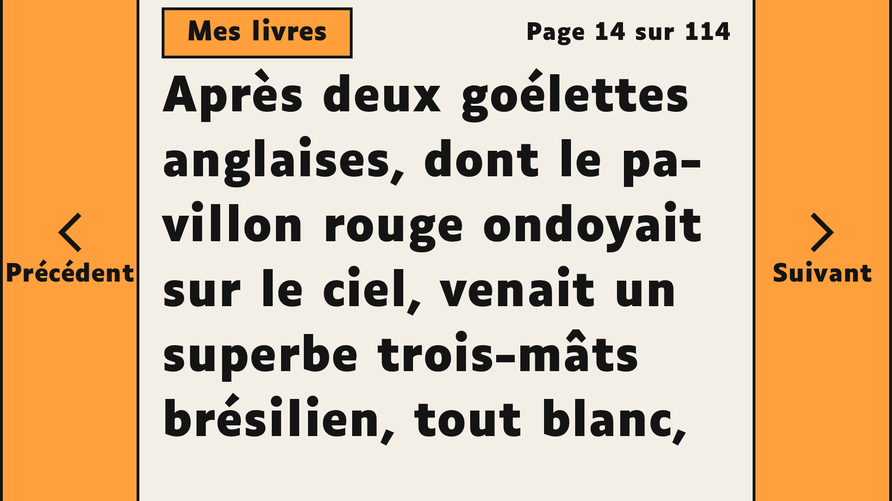
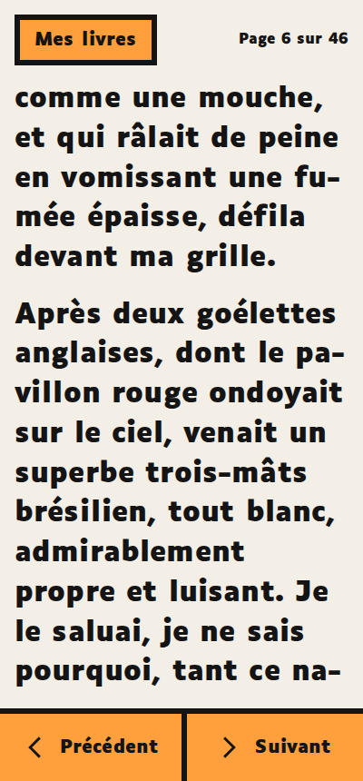
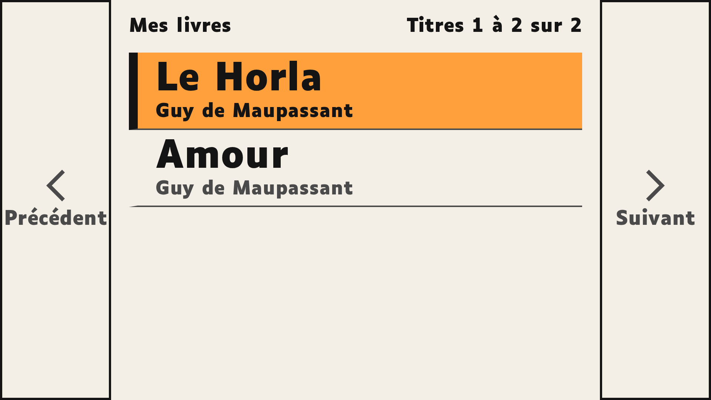
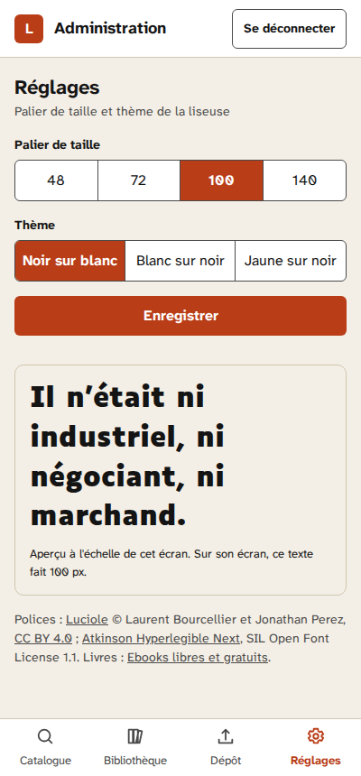
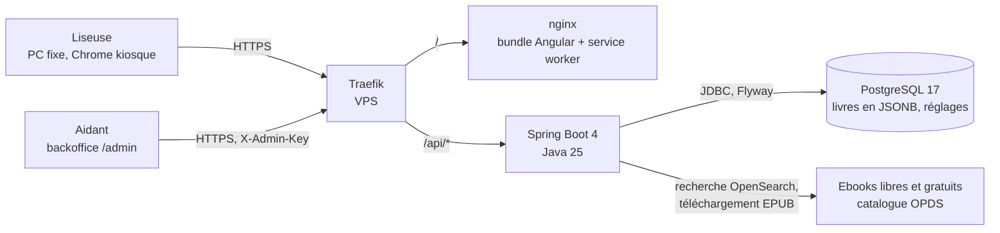

# Liseuse

[](https://github.com/ThomasHtn/book-reader/actions/workflows/backend-ci.yml)
[](https://github.com/ThomasHtn/book-reader/actions/workflows/frontend-ci.yml)
[](https://github.com/ThomasHtn/book-reader/actions/workflows/e2e.yml)

Une liseuse web pour une seule personne : une proche âgée, atteinte de DMLA débutante, qui ne lit plus
les gros caractères même à la loupe et n'utilise pas l'informatique. Elle clique sur l'icône du bureau,
retrouve sa page et lit. Un backoffice permet à l'aidant de choisir les livres et de régler l'affichage
à distance, depuis son téléphone.

Instance : [book-reader.thomashtn.dev](https://book-reader.thomashtn.dev) (non indexée).



## Trois commandes, rien d'autre

| Commande | Souris | Clavier |
|---|---|---|
| Page suivante | barre orange de droite, pleine hauteur | flèche droite ou espace |
| Page précédente | barre orange de gauche, pleine hauteur | flèche gauche |
| Mes livres | bouton en haut à gauche | Tab puis Entrée |

Pas de menu, pas de message, pas de confirmation. La DMLA dégrade la vision centrale et conserve la
périphérie : les commandes sont de grandes zones colorées aux bords de l'écran, le texte au centre.
Une commande reçue moins de 400 ms après la précédente est ignorée, la répétition d'une touche
maintenue aussi. La position est mémorisée à chaque page ; au démarrage, le dernier livre reprend.

## Captures

| Lecture (1920 px) | Lecture (400 px) |
|---|---|
|  |  |

| Mes livres (1920 px) | Backoffice, réglages (400 px) |
|---|---|
|  |  |

Captures générées par `SCREENSHOTS=1 npx playwright test e2e/screenshots.spec.ts` sur *Le Horla* de
Maupassant (domaine public).

## Architecture



- **Conversion côté serveur** : un EPUB (catalogue ou dépôt) devient une liste plate de blocs en texte
  brut, titre ou paragraphe ; la liseuse n'affiche que des nœuds texte.
- **Pagination par chapitre en colonnes CSS** : une page est une colonne de la largeur exacte de la zone
  de texte. Le livre entier dans un seul conteneur dépassait le plafond de mise en page de Blink et
  prenait plus d'une seconde sur un PC modeste ([essai](docs/specification.md#52-pagination)).
- **Position indépendante de l'affichage** : (index de bloc, décalage en caractères), retrouvée avec
  `Range`, stockée dans `localStorage` ; c'est aussi elle qui donne le pourcentage de progression affiché
  dans le coin supérieur droit.
- **Réglages globaux pilotés par le serveur** : palier (48, 72, 100, 140 px), relu toutes les dix
  secondes avec ETag, appliqué sans perdre la page.

## Développement

Prérequis : Java 25, Node 22, Docker (tests backend et bout en bout).

```bash
# Base locale jetable
docker run -d --name book-reader-db -e POSTGRES_DB=book_reader -e POSTGRES_USER=book_reader \
  -e POSTGRES_PASSWORD=book_reader -p 5432:5432 postgres:17-alpine

# API sur :8080 (Swagger sur /swagger-ui.html quand API_DOCS_ENABLED=true)
cd backend && cp .env.example .env && ./mvnw spring-boot:run

# Application sur :4200, /api relayé vers :8080
cd frontend && npm ci && npm start
```

## Tests

| Commande | Contenu |
|---|---|
| `cd backend && ./mvnw clean verify` | Checkstyle, tests JUnit sur PostgreSQL Testcontainers, SpotBugs, JaCoCo (90 % lignes, 70 % branches) |
| `cd frontend && npm test -- --watch=false` | Vitest : modules de pagination purs, services, écrans |
| `cd frontend && npm run lint && npm run format:check && npm run build` | ESLint, Prettier, build de production |
| `cd frontend && npm run e2e` | Playwright : parcours complet et axe-core sur chaque écran (jar construit, base vide sur le port 55432) |

Le convertisseur est testé sur des fixtures EPUB versionnées reproduisant les trois générateurs
rencontrés dans le catalogue ; le client OPDS l'est contre un serveur factice nourri de réponses
enregistrées, jamais contre le site.

## Déploiement

Deux images (nginx pour le bundle, jar Spring) derrière le Traefik existant du VPS, sur la même origine.

```bash
cp .env.example .env   # hôte, réseau et résolveur Traefik, base dédiée, clé d'administration
docker compose -f docker-compose.prod.yml up -d --build
```

L'installation du poste de la lectrice (raccourci Chrome en mode kiosque, session automatique) est
décrite dans la [section 16 du cahier des charges](docs/specification.md#16-installation-du-poste).

## Documentation

- [Cahier des charges](docs/specification.md) : parcours, pagination, API, schéma, décisions.
- [Design system](docs/design-system.md), avec [les tokens](docs/design-system/tokens.css) et
  [l'aperçu](docs/design-system/preview.html).

## Crédits

- Police **Luciole** © Laurent Bourcellier et Jonathan Perez, [luciole-vision.com](https://www.luciole-vision.com/),
  sous licence [Creative Commons Attribution 4.0](https://creativecommons.org/licenses/by/4.0/deed.fr).
- Police **Atkinson Hyperlegible Next** © The Atkinson Hyperlegible Next Project Authors, sous
  [SIL Open Font License 1.1](frontend/public/fonts/atkinson-hyperlegible-next/OFL.txt).
- Livres : catalogue [Ebooks libres et gratuits](https://www.ebooksgratuits.com/), textes du domaine
  public mis en forme par leurs bénévoles.

## Licence

Code sous licence [MIT](LICENSE). Les polices et les livres gardent leurs licences propres.
